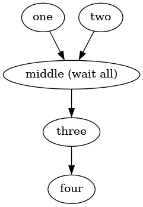
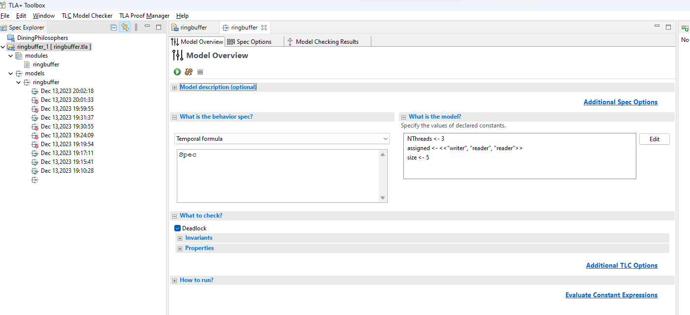
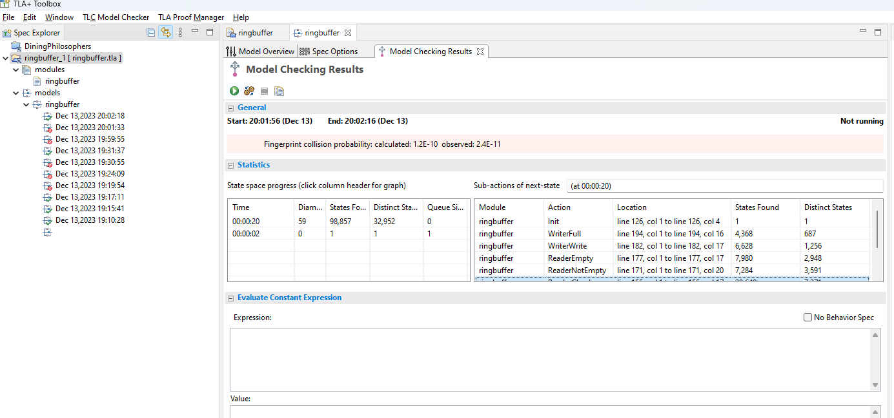

# parallel data race server

[Jump to summary of this repos files](#summary)

How do you implement a high performance low latency concurrency and asynchronous userspace parallel server programs? How does async work?

How do you implement fast parallel kernel commands such as parallel map? Or parallel iterate? Inspired by APL and array programming languages. And Volcano query execution for things such as parallel joins?

 * use threads for paralellism and use a number less than the number of physical cores in the CPU less one for the operating system
 * pin the threads to a particular core
 * split control flow into these threads but do not join (synchronize) frequently - shard truly with no synchronization on the hot path
 * minimise contention of locks, atomics or compare and swap
 * split threads into a topology for low latency (50-120 nanoseconds) so thread pairs for barriers or 4 threads for atomic synchronizer
 * split memory locations to avoid contention on a particular memory address on the memory bus when using atomics
 * avoid locks/mutexes and use lockfree algorithms
 * minimise the number of crossover communication points between threads and treat them as independent shards
 * have strict per-thread memory ownership. communication changes the owner unless its readonly.
 * use padding alignment to avoid false sharing
 * use io_uring
 * use linear arrays (vectors) apter trees
 * use structures of arrays
 * use memory tiling
 * use strides
 * use column major or row major access pattern
 * use database technology and its lessons. relational algebra
 * use async/coroutines
 * arrange a hiearchy of arrays is like register allocation for index transformations (perfect hashing)
 * Avoid scheduling costs if the pipeline is a direct pipeline

This is a GitHub repository of some components and design notes for building a flexible tool for server parallelism that handles fast parallel IO and fast parallel compute. It goes down into notes about assembly, custom syntax (a new language) compiler codegen design and runtime. I have tried to make the notes detailed so you know the design decisions and thought that went into its design and you could build the same kind of thing.

I am building a high performance low latency async parallel runtime as a hobby. My focus so far has been the communication runtime which provides safety between threads and coroutines.

Most web applications are single threaded behind the HTTP request handling.

This is designed for low latency and high throughput parallelism on large multicore machines such as 96 core or 192 core machines.

Progress table
|Area|Description|Completeness|
|---|---|---|
|Thread safe communication|over 5 threadsafe mechanisms of communication, 3 in C and 2 in Java.|Experimental|
|Coroutine API|||
|Async pipeline syntax|Parser in Javascript||
|APL style algebra|||
|Buffer movement|||


You can speed up computation by doing things at the same time - paralellism. Amdahls law means the speedup expectation is limited by the serialised portion of the work. Thread safety by mutexes suffer from contention when used by lots of threads and restrict useful parallelism. Atomics and compare and swap are tools that also suffer from contention.

Lock free algorithms don't use mutexes but use atomics (xchg) or compare and swap.

One CPU core cannot use the entirety of memory bandwidth but multiple threads can do lots more work and use the available bandwidth. You cannot accelerate a program that uses (writes to) the same memory location. This is due to contention and synchronization. We should instead make synchronization as valuable as possible.

Here's a parallel version of this graph in assembly. Parallel control flow is masked by jumps to the `synchronize` command of the runtime. This is a mixture of yield and fork.



```
one:
# get a buffer
# pushq %eip (if use jmps)
movq $128, %rdi # buffer size
call get_buffer

generate:
# eax has buffer pointer in
# move some data into buffer
inc rcx
movq %rax, (%eax)
addq %eax, $8

mov $1, (%eax)

# indicate buffer is finished
movq %eax, 1(%rsi)
# move buffer readiness flag

# store coroutine state
# give data
movq .one_yield1, %rsi

movq %rsp, %rdx # stack
movq %rdi, %rcx # buffer
movq %eip, %rdi # where we are, will be added to
jmp synchronize

one_yield1:
cmp %rax, $128
jne generate

two:
middle:
three:
four:
```


One thread can handle one and another two and another thread the remaining pipeline.


Colescing IO events


# Why I am unsatisfied with existing technology

I've written a toy JIT compiler and a number of parallel  lockfree runtimes for message passing: a phaser barrier inspired by bulk synchronous parallel, an LMAX Disruptor inspired ringbuffer, a single writer data mover and a parallel buffer manager (called atomic bcast). I have implemented a toy multimodal SQL database and am inspired by relational algebra and RocksDB.

I dont think existing runtimes have good observability for async coroutine behaviour.

I want to be able to run a tool  asyncps and see this information:

```
$ aps
  co:thrd ratio 20000:12
  async ratio 20:5
  coroutine 8000 cos/sec
  buffer transfers 10300 second
  [+] client (5789)
   [+]
   
 
```

+]
[+

I am inspired by Erlang's actor design but Erlang uses locks and is not a compiled language (BEAM virtual machine). I am inspired by Go lang but I think the throughput and latency could be higher and latency lower. (Go takes 200 nanoseconds to schedule a Goroutine) I also want to write code in a different style. I also want a thread per core design and to use lock free algorithms.

# Synchronization: Where do you draw the horizontal line?

If you think of parallel and concurrent system as interlocking gears the more engaged the gears they are the more synchronization there is.

If you disengage the gears then the system is without impedance an can operate independently and independently fast. Like a flywheel.

In a multithreaded progtam If you draw shards as a vertical tree, each thread's work goes from top down. If you synchronize there is a horizontal line that represents communication. Where you put this line determines performance characteristics.

One way to think of async tasks is to think of some code that has two sides to it - the task and then the code that temporally runs after the task is completed. This is typically a callback in other languages. Or a state machine rewritten async/await. LMAX splits IO into three parts - the part before the IO, the IO and the part to happen afterwards.

You can think of an await command as a pause command and the allowing the runtime to do something different while waiting for the Kernel runtime.

Note that an async runtime that uses callbacks will use threads or asynchronous IO. So it would spawn a thread or send a message to a threadpool queue and then the thread pool will send a message to the main thread to tell it to execute the user's callback.

How I think of async tasks is that there is a deliberate ordered sequence of desired tasks and this sequence is instanced (and turing complete) but at any point an alternative task could be scheduled if the desired task in the sequence is not ready which means there is a partial order to the async runtime. The runtime always runs the sequences in order but each instance of the sequence can be overlapping and/or interspersed with others. 


You might want to run task-a then task-b then task-c - in that order.

This pipeline looks like this

```
task-a | task-b | task-c
```

You have a table of different instances of tasks-a tasks. The task-a instances might look like this: 

```
task-a-1 task-a-2 task-a-3
```

And task-b and task-c tasks:

```
task-b-1 task-b-2 task-b-3
task-c-1 task-c-2 task-c-3
```

At any point any task from any table of tasks can be scheduled. So you could be completing tasks at a different lifecycle stage, interleaved and interspersed.

Now if we add parallelism to this. You could be executing a task-c at the same time as a task-a but for different instances of the pipeline.

Now imagine a server that processes user sessions in parallel.

The global pipeline is also turing complete: states can be returned to.

Your server is fully parallel. It has a coroutine for each connection and each request that the server makes is also in its own coroutine.

```
read-socket-data | parse-socket-data | dispatch-to-handler
```

A chat room might want to broadcast messages in parallel without waiting for messages from a client.


How I have chosen to think of async tasks is that there is events that are recorded when starting tasks and completions are matched to the event list when completed:

 * an event represents the completion of some action or completion of an coroutine task state/step
 * an event can indicate IO completion or compute completion or coroutine state change


Each of these subprojects had a different performance profile.
 * atomic bcast gets 9-10 million requests per second with 15 threads with latency around 100 nanoseconds
* the starbarrier multibarrier gets 30 million requests per second between thread pairs with lafency around 60
* the LMAX Disruptor gets latency around 50-120 depending on topology

To put this into perspective: this allows the number of parallel splits (or forks) to occur per second. Or work pickups.

One important thing is that the more threads that can write, the more contention you will have if they all want to write at the same time.

# Problems to solve in Parallel Asynchrony

There are the problems I shall talk about and this repository tries to make solutions to:

 * code generation for coroutines. Do we generate assembly with labels and need an assembler or do we write a linker?
 * cheap runtime scheduler
 * thread safe data streams
 * arbitrary turing complete iterators
 * calling convention between asynchronous tasks/coroutine to asynchronous task/coroutine. How does data go between tasks? Its not by the stack since the stack changes and there could be on a different thread so thread safety is needed
 * a syntax or API to define the ordering of asynchronous tasks. In Javascript this might be async library tools that allow chaining together promises or `.then`
 * switching stacks when changing coroutines
 * storing the stack RSP register somewhere when pausing
 * storing the instruction pointer somewhere when pausing
 * restoring the stack and instruction pointer when resuming
 * an API for imperative control of the running coroutine (yield data, pause until event, sleep)
 * handling return values from coroutines that yield and sending values back to them once resumed
 * do you need a reference to the corourine to send data to it? in Python you have a reference to the generator to send data to it
 * being able to implement **any grid of work** (support different models of parallel programming)
 * implementing a programming model that is easy to understand
 * deciding whether to parallelise data (and give it to the same or pipelined code) or paralellise control flow
 * designed for high number of threads
 * low latency
 * high throughput
 * low contention on the thread safe parts
 * how to have turing complete parallelism
 * unevenly sized control flow
 * loop stopping: how do you preempt a loop?

In the nodejs world which uses libuv and handles IO and compute tasks. Nodejs and browser engines use promises and async await to specify task sequences.

In single threaded designs there is also data flow, control flow and direction which program structure encodes. Who asks for what and who sends what where. Then you have logistics moving data to where it is needed or moving variables between and in parameters. If you refactor large code bases you are familiar with moving parameters around and making things available in different places. (Aside: this grouping style of "things" is an organisation could be a useful data structure Make this available here.)

You can think of code converging on a memory location or register from different control flows (such as different coroutines)

For example, a compiler pipeline has multiple stages. You can call the lexer from the tokeniser or run them as independent tasks and coordinate them from above in one place - this is composition. It can be desirable to decouple components for reuseability by other people or extension permutation.

I need to communicate, orchestrate and coordinate control flow across different threads but the number of threads involved in an exchange determines the efficiency of the cross thread mechanism due to coordination and thread safety costs. The more potential simultaneous writers the slower it will be.

In the Linux kernel there is io_uring which is a ringbuffer which regulates async access by userspace applications to make IO requests (read/write file or network) to the kernel and the kernel to receieve requests by the application and the application to get responses from the kernel. This crosses the kernel app barrier efficiently in bulk and scales.

Coroutines allow multiple separate execution sequences to coexist on a single thread and switched between alternately. They allow greater efficiency because multiple tasks can be in progress at the same time while waiting for things.

Stackful coroutines can call regular functions and stackless coroutines can only use a predefined block of memory.

Direction in control flow can limit design flexibility.

If you think of a microservice architecture you might sometimes want to be called when things happen or to call yourself.

Its the insertion point of indirection where you change direction of control or flow. From push to pull or pull to push or sync to async or async to sync.

Message passing is one approach.
In a message passing design you handle messages with different identities and the identity of the message determines what you do: where control flow jumps.

Actors is another approach.

Message passed control flow is an approach to coroutine scheduling which allows threads to direct control flow of other threads.

# Unevenly sized control flow

In an average aysnc code you have regions that can run and then there are pauses where other code runs. If you run the same async tasks multiple times then you might have uneven segments of computation that can be parallel.

In languages such as Rust and Go the scheduler is a work stealing so that work can unevenly accumulate on different threads. This requires work to move work to another thread.

The nature of the ideal scheduling depends on all the code that can run.

# Text format

a       b       c
 coro-1 coro-4 coro-7
 coro-2 coro-5 coro-8
 coro-3 coro-6 coro-9
 
Coroutine state announcement
pattern matching parser
regexp

coro-1 doesnt call coro-2 directly but writes to memory
interop between coroutines is by memory therefore

Colour grid - lanes
independent lanes can be parallel
reordering
number sequences, positions

# Coroutine states

I am unfamiliar with the literature on session types but these might be similar.

A coroutine has a number of different states which is actually a graph of valid control flow destinations from its current position.

For example, code that paginates or load balances

Transparent interleaving.

Automatic composition: you can refer to the aggregated output of a different component

Hidden pseudo method calls

A data structure of control flows.
graph of coroutine states
coroutine basic blocks

control flow is the message
check the same array or different array?

# Nested for loop data transformation

Computers are good at array transformations. ECS and data orientated design are approaches to maximise CPU performance.

Array that you write to and control flow. Reductions? Control flow over the data. Efficient control flow patterns.

If the array has different shape when writing.

```
for buffer in table:
  nextbuffer = next_destination()
  next_buffer[table[buffer]] = f()
```

arry[x] = arry2[b]
this can be autoparallelised

split IO and compute

expressions are traversals.. easy to pluralise code or add indirections!

types hardcoded lines
parallelism and plurality lines

# Monad ordering problem

draw the components/contexts and draw the data flow as lines

then the lines are reconciled automatically

# Subsumption Pratt parsing

Is there something generic about this? Trampolines, golangs mini interpreter for tail call optimisation

# Variable dimensions, growing and joins

if theres a relationship between two things it might be in a direction

allow the software to be dynamically reconfigured


# Calling convention

The C calling convention determines how machine code control flow sequences are switched between. CALL puts the EIP onto the stack AND JMPs elsewhere.

The C calling convention on my operating system (Ubuntu) is System V. The first 6 parameters are passed in rdi, %rsi, %rdx, %rcx, %r8 and %r9.

Coroutine calling convention is massively important for efficiency and thread safety.

When a coroutine is called it needs to look somewhere for data, it could even be in registers.
but if its on a different thread it is in main memory.

Data can be sent between thread topologies in 4 communication patterns that I have thought of listed below.

With multithreading and coroutines we have the following things to solve:

 * Memory management
 * Memory ownership
 * Thread safety
 * Ideal parallelism

I have a solution to memory ownership and memory management that is the generation of non overlapping sequence numbers that are thread safe called Atomic sequence number memory buffer management. This could be used for all coroutine communication.

Coroutines that nest are like transposed lanes. It provides nested parallelism. It is a bit like something that could move while youre moving it. It has separate independent states that change in parallel and independently.

move data into a cmp table
computer loop fast code buffers moving data around and then render it

collections for things

if statement 1 << 24 << if statememt 2

# Nested parallelism

You might have two or more processes that are independently parallel but want to interact.

This could be nested queues that also do things independently.

 process1
  queue1 | process2
 process2
  queue2 | process1

# 1-1

If we want to do something with some data and then hand if off to the next stage of the pipeline we have a 1 to 1 relationship between threads.

We can implement this by moving data into a free sequence number data buffer in atomic-bcast and indicate buffer readiness with a flag. (availability protocol)

With starbarrier, this is just sending data to a single mailbox.

This can even be used for multiple threads by load balancing which buffers are sent to so this is 1-*-1.

Equivalent to a fork

# 1-*

We want to broadcast the same data to multiple threads. We can arrange the data into a collection and each thread can pick up data for itself if required.

We move data into visible sequence number and each thread has its own consumption check to see if its seen that sequence number. This is like a cursor.

# *-1

We have multiple threads generating data and want to read all their input in one thread.

1 reader checks all mailboxes of other threads toward itself

Ordering?

# *-*

many to many broadcast
everyone keeps track of seen on self
visible sequence numbers
every thread checks visible sequence numbers


is this a limitation?
struct Value {
  void * data;
  int available;
};

generation number for wraparound detection

btree to index generator
rewriting btree on a split
compile parser for event checking

# Example topology

Topologies are turing complete
Both the coroutine and the data buffers being sent down can occur in any direction and order.

Deadline on real time kernels.

Data flow is not single direction like a pipeline.

send-thread1
 send-coroutine-
recv-thread1
 recv-coroutine
worker-thread-1
 worker-coroutine
 request-coroutine2
worker-thread-2
 worker-coroutine
 request-coroutine-1


# Scheduling and events: Latency of scheduling, checking for readiness

A coroutine runs and writes to a buffer and indicates buffer readiness with a memory flag.

The scheduler has a list of events in a trie, the events correspond to buffers permutations.

Since different threads can write to buffers but we might want to handle events in parallel, for handling on different threads we need the mechanism to be threadsafe. We don't use priority like a operating system scheduler.

We can sum the event buffer arrival counts to detect if a buffer has been written to.

If a buffer matches its preconditions it shall be scheduled to run.

We want coroutine execution to be turing complete.

A Buffer block is equivalent to control flow to another block on a another thread but is parallel.

Variables for anything and addressing them.

# Messaging

A buffer event can force a coroutine to execute from a position, this is like an actor.

Execute 10 times.

# Sequential, queuing

For sequential scheduling.

Do we have buffers event states for coroutine start and end and create the dependency chain that way?

# Coroutine Select

We might want to race code against eachother

```
runtime.either(a, b);
```

The scheduler has to check if either can run and then run one of them.

Fairness

# Types of parallelism

See this blog post: https://github.com/alexpusch/rust-magic-patterns/blob/master/rust-stream-visualized/Readme.md

I want to handle the kinds of parallelism that are useful.

How do we representing turing complete parallelism that can be turned on and off.

s1 -> s2
   -> s2

s2 -> s1

with regard to independence
split IO
recv independent with send

Specify all the states and nest them. It cartesian product ?

move a moving thing
runtime H
causality lines

Scaled coroutines for handling load/throughput
replicated parallel
Separated parallelism
GUIs
Network app split io parallelism

Threed a parallelism where body of loop is divided into pieces and each segment is replicated across threads.

Blocks are replicated across threads

# Integer calculation to memory location

# Movement of a moving thing

If two things can independently change states and we want to catch all changes between them when they change.

# Protocols

# Block iterator fusion

APL

# Chunking

outer_chunk:
inner_chunk:

# Wait statement


# Message handling semantics

When I send a message to another thread there is a number of different scenarios I might want to handle:

 * **Wait 1** wait for receiver to acknowledge message. This is synchronous style. This puts the coroutine to sleep.
 * **Dont wait** don't wait for receiver to acknowledge message (parallelism)
 * **Wait multi** receieve multiple messages from receiver
 * **Wait message** wait for message from receiever
 * **Wait pattern** wait for multiple messages from receiver

state progressions and control flow progressions

the pattern of messages is parsed

# Turing completeness of the running code

Being able to jump to any state in parallel.
letter H is a join

# Join patterns: Waiting for events to complete and pattern matching

When threads have completed their task they need to move to the next task. Or a sequence that is split across threads needs to resume processing.

Control flow is turing complete.

Control flow is defined across multiple async tasks that can arrive in any order.

Future control flow can depend on current control flow AND state.

This is parsing.

We can use counting to identify when things are finished. This is what starbarrier does.

Atomic-bcast uses an atomic integer.

http client parsing along consume-char

# Runtime or compile time? Both at the same time

Some way to detect if something can be compiled or runtime based on the program that generates the control flow sequence and if its a basic graph. We can detect properties in the block relationships to see what needs to be checked at runtime.

We can use blocks for this.

Data parallelism.


# Coroutine calling convention

Coroutines communicate data with eachother and they may pass data between different threads.

The basic blocks of a coroutine could be anything with loops and conditionals. This means data could be yielded in any order.

A coroutine requests a buffer and it is stable within that thread before it changes owners.

 * An incrementing buffer, is like a stream of values by the same buffer.
 * Different buffers have different identities. This is essentially message passing.

Newbuffer creates a sequenced buffer.

```
b = newbuffer();
while True:
  b.data = "6";
  runtime.yield(b);
```

When a coroutine yields, upon resuming the coroutine must restore state such as all local variables and registers.

coroutinesdirect
yield takes coroutine id and looks up the coroutine list and jumps to the eip in the table

the runtime
needs to invoke a scheduler that parses based on event rules, this could be barrier runtime

Coroutine table is Lateral control flow

# Barrier bcast and stream workqueue

If you have 96 threads, you 24 streams with 4 threads each.

The global atomic integer prevents

Reading is always behind writing, so the last stream is stream 0, which isn't used.

|Bit position|Name|Meaning|
|---|---|---|
|24-32|Stream|The subgroup for threads|
|16-32|Globalwrite|The thing that keeps threads synchronized|
|0-8|Readcursor||

The reading stream is behind all the streams at 0, it starts at 0.
All the other streams start at their group.

so these two loops are in parallel:

// reading
for (int readstream = 0 ; readstream < (threadsize / 4); readstream++) {
  buffer = readstream << 24 | myglobalread << 16 | readcursor;
}
// writing
for (int x = 0 ; x < 0xff; x++) {
  buffer = threadindex << 24 | globalwrite << 16 | x;
}

You would think that the reader could catch up with the writer, because of readstream. But the read is gated by an if statement check checks myglobalread < globalwrite.

Write stream starts at their thread group

1 1 1 1
1 1 1 1
2 2 2 2
2 2 2 2

0 1 2 3
0 1 2 3

It occurred to me that each thread's readstream is starting at 0 and going up. So it's a true broadcast.

Independent for loops - you specify how they overlap in sequence numbers
Join of a for loop - it's a relation, each iteration is a line


High level semantic Data flow analysis of programming languages

Whats easy what is hard from assembly perspective

# Iterators and basic blocks

flywheels and gear engagement
the block target depends on block origin/previous

You can think of an iterator as basic blocks.

Basic blocks are remembered and constitute state of the coroutine.

mov $CONSTANT, %r11

the topology is automatic
chunks are iterator blocks

blocks are iterators

computer path finding between stack position synchronization

the blocks need to interleave in the right order. the data can be logistically filled

Sequence doesn't have to match exactly to be compatible
graph ismorphism

Control flow is stateful. you specify all the state WITH control flow block names and thats its type of that block.

which blocks alias on state

yield 1
yield 2
yield 3

This sequence has no stateful type of control flow.

you write you want something before after or around

block1:
while i < 6:
  yield 6
  i++
  
block2:
while i > 6:
  i < 6.block2:
  yield -6
  --+;

parameterized control flow

how blocks fit together and interleave
you specify the behaviour and the computer works out the logistics

the control flow sequence can be reordered like data (which is a program)

the type is block successors

bind with equal symbol

monads
the blocks do the same things they compatible

the values in the blocks refer to are blocks too

context, whats on the stack at a point
blocks can keep track of what is on the stack

block binding (variables, data)

parsing trees and graphs to blocks
the tree structure prevents flexibility

refer to predecessors in a typed control flow

what is a tree as a block?


paginate | rate-limit | 

check:
if requests_in_bucket > limit:
  do_nothing
else:
  do_request
  requests_in_bucket++

generate:
items = []
do_again:
for item in range(0, pagesize):
  items += data[item]


movq $0, %ebx
movq $100, %rdx
do_again:
addq $1, %ebx
cmp x, max
je finished
jmp do_again

movq $100, %ebx
movq $0, %rdx
cmp
jgt do_nothing
jmp do_it

binding to compose these codes is

paginate × ratelimit
subsume do_request=do_again

just specify the control flow types

block plurality.
if theres multiples at different points 
software architecture as a data structure

shape of blocks holes

groups of data from a memory address block compatibility

references to offsets such as stack or heap memory pointer

mov $CONSTANT, %r11

Tape SIMD

Iterators: a page chunk can just be a type of parameterized control flow.

control flow is a data structure, with labels
if its a graph there might need to be runtime dispatch

its a flat sequence flow chart, each block has a name, loops are parameterized

assembly has the detail of the return point
a nested loop depends on state, parameterized by state

is the scope for this block lexical or dynamic that determines the dispatch,
holes in the sequence, monads

parameterized block
while True: 
  for items in range(0, items):
    page()
  yield

dependency graph of an iterator what state is dependent

A nested switch statement is a tree
depends on state

loops

return to point with new state, assembly

State()
rate limiting
chunking

Amusingly, a lot of value is in fast dispatch to IO and fast dispatch to control flow.

recv side needs to send data
recv thread sends to send thread, with atomic bcast sequence numbers?

thread pair, the if statement mutex, barrier

waiting for things to be ready
test dependencies
topology comes into play
coroutine toplology links to thread topology

send-coroutine fact
  recv-coroutine
recv-coroutine fact
  send-coroutine

send-coroutine waits on recv-coroutine to send some data to it

sequential code generation when number of items grows to certain amount then use parallel executor

the intuitive idea of side by side tables collections processed by an async runtime... the intuition over what is fast

everything is data parallelism, and tables

control flow parallelism isnt as effective maybe ?

the parallel functions in rust for a pipeline step is too small

either the function is split into stages and multithreaded or the data is split and each thread does a bit

a stream logic is broken into chunks that process but the data is divided so its always even

block filling monads
join statement
map a imperative program to a stream

wait for reply syntax

nested list with references can express many relationships like a graph

graph colouring

monad

arrange the block sequence over threads

struct as a relational row

socket 
 request-coroutine
 send-coroutine
 recv-coroutine

communicate by memory

sql query to control flow
blocks are objects

parsing is a powerful traversal
state machine formulation provides that
parsing is an event stream

plurality

autoparallelization, of data going in PLUS control flow

generate all C code in a single C method

recv-coroutine hosted by ioring-recv thread
data = socket.read()
send-coroutine.send(data) # cross thread com

atomic bcast, sending to a coroutine sets a flag in the active sequence number mailbox and the data

coroutines have read cursors for every other coroutine, like a stream

barrier, each coroutine is a task in the task list?
factgroup, coroutines

request | recv | send
 > each of these component can be scaled independently.

if two coroutines communicate, you dont want to run a paused coroutine.

the barrier protects the communication, with a queue, coroutine inboxes, independent in time pointer swaps

lookup thread of coroutine and send to that thread

the program control flow is a state!! the state machine formulation describes the valid states of the control flow

program is inverted. this programs reads from recv-coroutine, reads a method call

if theres no logic between the steps they can be hard wired

counted btree turing machine, not instructions tape but btree nodes

a program that is not quite imperative but reflects control flow

control flow blocks

yield writes a row into database, that can go somewhere else later

slow request permission, reserved capacity
pipelines code view, see the expected sequence callflow near the code in view 

Programs can be thought of protocols or conversations, where multiple components talk to eachother.

For example, a HTTP protocol is a conversation between a client and a server.

A web server such as nginx is optimised for lots of concurrent and parallel requests.

The goal of this project is that I can describe high level semantics of what should happen and the computer parallelises it.

This is incomplete.

git data structures and control flow

layout compiler - not a sequence that a programmer writes but is autogenerated.

working out the movement logic through swaps and positional questions and algebra

The goal is you can write a protocol and it is autoparallelised.

a data structure for a record, a btree

file processes by independent parallelism buckets, different rates
how to generate a stream that is fed to multiple programs

collapse events
continuation passing

Everything is a coroutine

the types of data output by each stage of coroutine are different

interleaved code


stack stack stack stack

setstack
call


yield 3, "blah"

each yield is an insert into a table

memory buffer for each coroutine state

This is an experimental project from my learning of assembly and C.

You're writing an application that serves requests on the web and you have a number of database queries to do to render a page. You want requests to the web page to be returned as fast as possible with minimum latency. Latency and throughput is a tradeoff with eachother.

Ideally you want to make as many separate requests as possible simultaneously in parallel, so the backend can work on retrieving these items with its multiple resources. This sets a fixed amount of higher resource usage (CPU+memory+network) while all the requests are being handled.

Or you have an event stream that is constantly growing such as social media or social network feeds.

HTTP state in buffers

When a HTTP event is received it is parsed and placed into buffers for bulk processing.

A bucket that refills.


coroutine btree
indexed computation counted btrees

Communication pattern
Do these tasks as fast as you can, from any thread.

send to one thread
send to any thread

select http_request from http_requests where url = /signup

insert into event table

insert into network_send values (0, "hello world")

insert into read values(file1, 5050)

insert time might not be when it executes

every line is async

a coroutine per client

"return" is an instruction to the runtime

```
thread-1
 client-5
  -> parse-request
  -> read
  -> make-sql-requests
    -> one
    -> two
    -> three
 client-6
  -> 
```

iterators and tables and buffers and chunks

memory
control flow
protocols


send tasks to other threads
rip current position

explicit replies, no return values to functions. like a broadcast if multiple people want to be notified

coroutine object spawns other parallel tasks

just specify what you want to happen.
replies are explicit.

for item in items:
  do something

read file, send over network, events interleaved or batched.

sql imquery that does the scheduling

```
25 get-recent
22 login
24 get-recent
```

Specify the bottlenecks. Specify the indirections.

What do you need to do in this context to change control flow to over here?

a btree could be in the buffer endless streaming

managing control flow streams

Do user applications use an io_uring style interface to handle buffer readiness? I would like to abstract the control flow from the applications.


# Efficient kernels

Patterns abstracted so most work is in the kernel

Destination is wired directly. No data passing cost.


 * **Concurrent and parallel coroutines** 
 * **Linux io_uring** Network IO is done using Jens Axboe's io_uring
 * **Split IO** We run two io_urings in two separate threads: one for **send** and one for **recv** This means you can parallelise reading and sending.
 *  **thread per core** each core is a bucket that executes work.
 *  **async pipeline syntax** Configure sequences of tasks that render to grids.
 *  **send work to the data** Similar to how Seastar sends functions to where data is.
 *  **phaser runtime** lock free no mutexes
 *  **message passing** double buffering is used for fast transfer of ownership between threads
 *  **event bucketing**
 *  **generate straight line single core sequential code but also generate parallel code**
 * **scalable work distribution** enqueue work and dequeue work and distribute across threads

# questions i want to answer

 * how do update a field faster than single core possible memory throughput? eventual consistency
 * is it still valid? timespans
 * valid for X period debounce

|Workload|Description|
|---|---|
|Many independent tasks|I want to start many small tasks with low latency.|
|Large amounts of data with the same operation||
|A large amount of data with many expensive steps||
|Many different disparate queries||
|Any thread can submit a task, One thread does the work|Contention on the workqueue|


Communication by control flow

Endless streaming - buffer locations generated endlessly. No conflicts due to isolated memory locations.

is the latency too high ?

Can use the available protocol
the rotation CAN be arbitrary different rate threads

SIMD and sql queries


when to switch buffers.

Writecursor switching is fine.
but waiting for sync is slow.


can parallelize iteration of a big data set

# single writer scheduler workqueue

If there is multiple single writers. Each single writer can dispatch any number of threads 3 million messages a second.

I want to distribute work to threads efficiently and at low latency.

LINQ parallel multiplicated parallel replicated parallel

I want to fork work fast and process with low latency.

 defining an iterator, join is an iterator

monads coroutine iterators

paginate, movement

how to model a work queue as communication patterns.


multiple threads can enqueue
single writer
the binary available protocol works


```
dequeue-work-item
enqueue-item
```
approach to thread safety.

**todo**:

 * **Coroutines API**
 * **msquic** Can use Microsoft's msquic implementation for fast UDP traffic.
 *  **rocksdb** Built with rocksdb
 *  **wasm runtime**

# downways split

A A A > (to completion)
B B B (downways)

Do the first operation on all the data.
then the second

SQL cloud - you provide the sql of your pages 

# Coroutines API

|Function|Description|
|--|--|
|yield_until|Yield until a fact is true|
|yield|Yield|
|start|Start a task in parallel and concurrently|
|when|Wait for an event to be fired|
|register_when|when this happens do X|
|send|Send data to another thread|

Start a process and it can send events back to parent.
event scheduling when events are a faucet.

outer when - do stuff and it goes into event loop

sending the data + function to execute next, in a pointer,

its just control flow.


# coroutine scheduler

Check the size of the queue to decide who to send to.

We want to send to a worker which has a small amount in its queue. how to thread safely check its queue?

work 

work stealing, atomic write owner to queue field. skipped over.
ack protocol.

lockstep work stealing, only one thread can steal at a time

nested semaphores

// threads 1-12
// thread 1
if tasks.taskindex == workindex
  workindex++
  locked
  

position of the other iterator

// thread 2
if tasks.taskindex > threads[0].workindex:
  value = 2

single writer transacter, read all memory changes everything
someone needs to renumber the tasks

acknowledgement

fractal mutex owned values in memory- determine memory location to write to

# Event stream parsing

We can think of the runtime as receiving events: buffers written to and coroutines pausing or resuming.

Each thread of the runtime is processing events on that thread as a lexing source. Each thread monitors/observes other threads for events for triggering new behaviours.

The scheduler is a proper parser which waits for patterns and issues commands.

This uses the same techniques as pattern matching streams. It is a tree of spans where event submission is handled.

An API for notifying that an address changed. Post a pointer for monitoring.


If an event is fired that the parser doesnt handle then thats an error.

Algebraic memory swaps linear types: terms and collections of terms and swapping

coroutine
  run states:
    x
    y
    z
  

  if buffer[x] == 6:
    fork a x b
    while True:
      if buffer[y] == 7:
  

coroutine
  buffer[x] == 6
  fire x

The control flow of the parsing coroutine is the driving of the rest of the system.


Do all buffers yield ?
Can a buffer be ready without a yield?


# also in this repository
<a name="summary"/>

This repository has:

 * a nonblocking barrier runtime: no mutexes in C
 * an LMAX Disruptor inspired ringbuffer in C
 * the beginnings of some TLA+ modules to try work out if my multithreaded algorithm is correct.
 * a [simple summary](https://github.com/samsquire/assembly/blob/main/assembly/README.md) of what I've learned programming in assembly
 * Marce Coll's tweaked coroutines assembly coroutinesdirect.S
 * Some TLA+ notes [Jump to TLA+ section](#tla-notes) My TLA+ model is still in progress.

|File|Description|
|---|---|
|disruptor-multi.c|1 writer thread and 2 consumer threads|
|disruptor-multi-producer.c|2 producer threads and 1 consumer threads. This is not thread safe yet.|
|disruptor-multi-consumer.c|2 producer threads and 2 consumer threads. I have attempted to make this thread safe but I need to think on it longer.|
|multibarrier.c|6 threads that all wait for eachother, mass synchronization|
|multibarrier-prearrive-nv.c|The same multibarrier with 6 threads wait wait for eachother|
|multibarrier-evented.c|A starbarrier, fast thread communication between thread pairs and then slower topology for forking tasks. Uses mutexes.|
|multibarrier-evented2.c|Doesn't use mutexes.|
|multibarrier-evented3.c|Fast. High throughput.|
|multibarrier-evented4.c|Low latency, low throughput|
|multibarrier-evented3-fswap.c|Does a friend swap on every superstep cycle|
|multibarrier-evented4-fswap.c|Does a friend swap on every superstep cycle|
|multiabrrier-split-io|Parallel io_uring, threads for sending/recving |
|multibarrier-evented2.c|Doesn't use mutexes, single writer.|
|multibarrier-evented3.c|Multiwriter.|
|multibarrier-evented4.c|Low latency but low throughput.|

# multithreaded nonblocking barrier-runtime
# nonblocking-prearrive

This is my [Samuel Michael Squire](https://samsquire.com/), sam@samsquire.com) lock free algorithm and runtime for a nonblocking multithreaded barrier. It is Zero Clause BSD Licenced.

```
Total Requests 27317816286

Total Protected 63025917
Total V 63025917

Total Protected per second 2100863
Total money 500 (correct if 0 or 500)
Total external thread ingests per second 2691622
Total intra thread sends per second 409855901
Total Requests per second 910593876
Total sents 409855901
Total receives 40985590
```


On a Intel(R) Core(TM) i7-10710U CPU @ 1.10GHz, 1608 Mhz, 6 Core(s), 12 Logical Processor(s) CPU on Windows 11 Intel NUC inside an Lubuntu virtual machine.

This algorithm is inspired by [Bulk synchronous parallel](https://en.wikipedia.org/wiki/Bulk_Synchronous_Parallel).

This algorithm uses ideas from my **M:N** thread scheduler, which is at [samsquire/preemptible-thread](https://github.com/samsquire/preemptible-thread).

In Go, if you are sending 64 bits of data to a channel, this causes unnecessary context switches in the go scheduler.

This algorithm is based on the idea there is a timeline grid of work to do and we synchronise in bulk on an interval. For the vast majority of time every thread is doing useful work, and synchronization is **total synchronization** between all threads in the cluster. Each thread has its own collection of **supersteps called BarrierTasks**. Each thread can do a different task in eachstep.

When the `BarrierTask.task_index == BarrierTask.thread_index`, we are guaranteed to be the only thread executing this code. This is similar to a critical section or a mutex. The great thing about this algorithm is that we can synchronize and do data transfer in bulk.

This barrier creates the following rhythm. The threads can arrive in any order, but they **do not start the next superstep** until they have all sycnhronized the previous superstep.

```
8 Arrived at task 0
5 Arrived at task 0
2 Arrived at task 0
6 Arrived at task 0
3 Arrived at task 0
4 Arrived at task 0
7 Arrived at task 0
0 Arrived at task 0
1 Arrived at task 0
9 Arrived at task 0
9 Arrived at task 1
3 Arrived at task 1
4 Arrived at task 1
8 Arrived at task 1
7 Arrived at task 1
5 Arrived at task 1
6 Arrived at task 1
1 Arrived at task 1
2 Arrived at task 1
0 Arrived at task 1
5 Arrived at task 2
6 Arrived at task 2
0 Arrived at task 2
1 Arrived at task 2
8 Arrived at task 2
7 Arrived at task 2
9 Arrived at task 2
2 Arrived at task 2
3 Arrived at task 2
4 Arrived at task 2
4 Arrived at task 3
7 Arrived at task 3
3 Arrived at task 3
9 Arrived at task 3
6 Arrived at task 3
8 Arrived at task 3
5 Arrived at task 3
1 Arrived at task 3
2 Arrived at task 3
0 Arrived at task 3
4 Arrived at task 4
8 Arrived at task 4
1 Arrived at task 4
5 Arrived at task 4
7 Arrived at task 4
6 Arrived at task 4
2 Arrived at task 4
9 Arrived at task 4
0 Arrived at task 4
3 Arrived at task 4
3 Arrived at task 5
5 Arrived at task 5
9 Arrived at task 5
6 Arrived at task 5
7 Arrived at task 5
8 Arrived at task 5
4 Arrived at task 5
0 Arrived at task 5
1 Arrived at task 5
2 Arrived at task 5
4 Arrived at task 6
2 Arrived at task 6
7 Arrived at task 6
6 Arrived at task 6
8 Arrived at task 6
5 Arrived at task 6
3 Arrived at task 6
9 Arrived at task 6
0 Arrived at task 6
1 Arrived at task 6
4 Arrived at task 7
9 Arrived at task 7
5 Arrived at task 7
7 Arrived at task 7
3 Arrived at task 7
6 Arrived at task 7
8 Arrived at task 7
2 Arrived at task 7
1 Arrived at task 7
0 Arrived at task 7
3 Arrived at task 8
5 Arrived at task 8
6 Arrived at task 8
2 Arrived at task 8
4 Arrived at task 8
7 Arrived at task 8
8 Arrived at task 8
1 Arrived at task 8
9 Arrived at task 8
0 Arrived at task 8

```

See [volatile considered harmful](https://www.kernel.org/doc/html/latest/process/volatile-considered-harmful.html).

These algorithms use compiler memory barriers and happens before relationships. I take advantage of benign data races. **If you use atomics, the program is slow**. There is a whitepaper called ["How to miscompile programs with “benign” data races"](https://www.usenix.org/legacy/events/hotpar11/tech/final_files/Boehm.pdf) There are errors reported by Thread Sanitizer. There is a **happens before** relationship between **arrived** and writes to arrived always **come from the same thread**. If they are observed by another thread the value is stale, it doesn't **seem** to affect correctness.


# THROUGHPUT vs LATENCY

LMAX Disruptor can transmit a message between threads with average latency of 53 nanoseconds.

This assumes there is a thread busy spinning on a sequence number and waiting for it to become available when another thread (a producer) has written it.

The `multibarrier-prearrive` latencies:

```
2 tasks (1) synchronized in 0 seconds 0 milliseconds 42 nanoseconds
2 tasks (2) synchronized in 0 seconds 0 milliseconds 51 nanoseconds
2 tasks (0) synchronized in 0 seconds 0 milliseconds 42 nanoseconds
2 tasks (1) synchronized in 0 seconds 0 milliseconds 42 nanoseconds
2 tasks (2) synchronized in 0 seconds 0 milliseconds 49 nanoseconds
2 tasks (0) synchronized in 0 seconds 0 milliseconds 45 nanoseconds
2 tasks (1) synchronized in 0 seconds 0 milliseconds 42 nanoseconds
2 tasks (2) synchronized in 0 seconds 0 milliseconds 48 nanoseconds
2 tasks (0) synchronized in 0 seconds 0 milliseconds 45 nanoseconds
2 tasks (1) synchronized in 0 seconds 0 milliseconds 43 nanoseconds
2 tasks (2) synchronized in 0 seconds 0 milliseconds 46 nanoseconds
2 tasks (0) synchronized in 0 seconds 0 milliseconds 41 nanoseconds
2 tasks (1) synchronized in 0 seconds 0 milliseconds 44 nanoseconds
2 tasks (2) synchronized in 0 seconds 0 milliseconds 46 nanoseconds
2 tasks (0) synchronized in 0 seconds 0 milliseconds 48 nanoseconds
2 tasks (1) synchronized in 0 seconds 0 milliseconds 44 nanoseconds
2 tasks (2) synchronized in 0 seconds 0 milliseconds 45 nanoseconds
2 tasks (0) synchronized in 0 seconds 0 milliseconds 45 nanoseconds
2 tasks (1) synchronized in 0 seconds 0 milliseconds 48 nanoseconds
2 tasks (2) synchronized in 0 seconds 0 milliseconds 51 nanoseconds
2 tasks (0) synchronized in 0 seconds 0 milliseconds 40 nanoseconds
```


# how it works

If you imagine a 2 dimensional table or grid with **workers (threads) that are rows** and **tasks that are columns**, the identity matrix is a row and column in that grid that if the task index is equal to the worker (thread) index then there is nobody else executing that: you get mutual exclusion. It is diagonal line through the grid over time.

```
void* barriered_thread(void *arg) {
  struct KernelThread *data = arg;
  // printf("In barrier task %d\n", data->thread_index);
  int t = 0;
  while (data->running == 1) {
    if (t >= data->task_count) {
      t = 0;
    }
    // printf("%d reporting %d %d\n", data->thread_index, t, data->task_count);
    for (; t < data->task_count; t++) {
      // printf("%d %d\n", data->thread_index, t);
      if (data->tasks[t].available == 1) {
        int previous = t;
        if (t > 0) {
          previous = t - 1;
        } else {
          previous = data->task_count - 1;
        }
        int arrived = 0; 
        for (int thread = 0 ; thread < data->thread_count; thread++) {
          // printf("thread %d does %d %d %d == %d\n", data->thread_index, t, previous, data->threads[thread].tasks[previous].arrived, data->tasks[t].arrived);
          if (data->threads[thread].tasks[previous].arrived == data->tasks[t].arrived) {
            arrived++;
          } 
        } 
        if (arrived == 0 || arrived == data->thread_count) {
          // we can run this task

          data->tasks[t].available = 0;

          data->tasks[t].run(&data->threads[data->thread_index].tasks[t]);
          data->tasks[t].arrived++;
          asm volatile ("mfence" ::: "memory");
        } else {
          // printf("%d %d %d\n", data->thread_index, t, arrived);
          break;
        }   
      } else {
      }
    }
  } 
  return 0;
}
```

This is what the work task looks like:

```
int barriered_work(volatile struct BarrierTask *data) {
  // printf("In barrier work task %d %d\n", data->thread_index, data->task_index);
  // printf("%d Arrived at task %d\n", data->thread_index, data->task_index);
  volatile long *n = &data->n;
  char *message = malloc(sizeof(char) * 256);
  struct Message *messaged = malloc(sizeof(struct Message));
  memset(message, '\0', 256);
  sprintf(message, "Sending message from thread %d task %d", data->thread_index, data->task_index);
  messaged->message = message;
  messaged->task_index = data->task_index;
  messaged->thread_index = data->thread_index;
  // we are synchronized
  if (data->thread_index == data->task_index) {
      void * tmp; 
      // swap this all thread's write buffer with the next task
        int t = data->task_index;
        for (int y = 0; y < data->thread_count ; y++) {
          for (int b = 0; b < data->thread_count ; b++) {
              int next_task = abs((t + 1) % (data->task_count));
              tmp = data->thread->threads[y].tasks[t].mailboxes[b].higher; 
              // data->thread->threads[y].tasks[t].mailboxes[b].higher = data->thread->threads[b].tasks[next_task].mailboxes[y].lower;
              data->thread->threads[b].tasks[next_task].mailboxes[y].lower = tmp;
            }
        }
      asm volatile ("mfence" ::: "memory");
        // printf("move my %d lower to next %d lower\n",data->task_index, next_task);


    clock_gettime(CLOCK_REALTIME, &data->snapshots[data->current_snapshot].start);
    int modcount = ++data->thread->protected_state->modcount;
    while (data->scheduled == 1) {
      data->n++;
      data->protected(&data->thread->threads[data->thread_index].tasks[data->task_index]);
    }
    if (modcount != data->thread->protected_state->modcount) {
      printf("Race condition!\n");
    }
    clock_gettime(CLOCK_REALTIME, &data->snapshots[data->current_snapshot].end);
    data->current_snapshot = ((data->current_snapshot + 1) % data->snapshot_count);
  } else {
        for (int n = 0 ; n < data->thread_count; n++) {
          if (n == data->thread_index) { continue; }
          struct Data *me = data->mailboxes[n].lower;
          for (int x = 0 ; x < me->messages_count ; x++) {
            data->sends++;
            // printf("on %d from %d task %d received: %s\n", data->thread_index, n, data->task_index, me->messages[x]->message);
            if (me->messages[x]->task_index == data->task_index && me->messages[x]->thread_index == data->thread_index) {
              printf("Received message from self %b %b\n", me->messages[x]->task_index == data->task_index, me->messages[x]->thread_index == data->thread_index);
              exit(1);
            }
          }
          me->messages_count = 0;
      }
        while (data->scheduled == 1) {
          for (int n = 0 ; n < data->thread_count; n++) {
            if (n == data->thread_index) { continue; }
            struct Data *them = data->mailboxes[n].higher;
            data->n++;
            // printf("Sending to thread %d\n", n);
            if (them->messages_count < them->messages_limit) {
              them->messages[them->messages_count++] = messaged;
            }
          }
        }
      asm volatile ("mfence" ::: "memory");
  }
  return 0;
}
```


This is what happens when all tasks are finished:

```
int barriered_reset(volatile struct BarrierTask *data) {
  // printf("In barrier reset task %d %d\n", data->thread_index, data->task_index);
    for (int x = 0 ; x < data->task_count ; x++) {
      // printf("Resetting %d %d\n", n, x);
      data->thread->threads[data->thread_index].tasks[x].arrived++; 
      // data->thread->tasks[x].arrived++; 
      
      data->thread->tasks[x].available = 1; 
  }
  asm volatile ("mfence" ::: "memory");
  return 0;
}
```

# external thread ingest

The multithreaded barrier can ingest events from an external thread, which is slower than running internal to the barrier.

For each thread that wants to talk to the multithreaded barrier, the thread must create a `Buffers` and send data in that. The `Buffers` external thread interface to multithreaded barrier is only safe if it is used in a 1 to 1 relationship.

# usage

To compile
```
gcc barrier-runtime.c -o barrier-runtime -O3 -luring 
```

To run
```
./barrier-runtime
```


# TLA Notes

This is my understanding of how TLA+ works.

TLA+ creates a graph of every state and explores state space. You can make assertions over state space.

The apostrophe after a variable represents the changed result.

```
/\ means And
\A means ALL
\E means there exists
```


```
Check(Self) == /\ a /\ b /\ c
```

## Ringbuffer Model





```
```
# Ordering things without complexity

Rest on/complicated ordering depends on perspective/convoy/access convoy
  v2
v1 v3
  v4
cartesian


combination logic: a document that describes behaviour accurately and is casually readable
different primitives - control flow segment and swaps (algebra)

swap into CPU/coroutine
swaps all way down

architecture plurality

pattern match ANY control flow event and its compiled down by aggregating all scenarios


# LICENCE

Copyright (C) 2023 by Samuel Michael Squire sam@samsquire.com                                                                                         

Permission to use, copy, modify, and/or distribute this software for any purpose with or without fee is hereby granted.                               

THE SOFTWARE IS PROVIDED "AS IS" AND THE AUTHOR DISCLAIMS ALL WARRANTIES WITH REGARD TO THIS SOFTWARE INCLUDING ALL IMPLIED WARRANTIES OF MERCHANTABILITY AND FITNESS. IN NO EVENT SHALL THE AUTHOR BE LIABLE FOR ANY SPECIAL, DIRECT, INDIRECT, OR CONSEQUENTIAL DAMAGES OR ANY DAMAGES WHATSOEVER RESULTING FROM LOSS OF USE, DATA OR PROFITS, WHETHER IN AN ACTION OF CONTRACT, NEGLIGENCE OR OTHER TORTIOUS ACTION, ARISING OUT OF OR IN CONNECTION WITH THE USE OR PERFORMANCE OF THIS SOFTWARE.   

 # Idea Journal

 target, ctrl+r

 n body reflection

 why dont authors of websites do some optimisation on the code and generate optimised ast data files for fetching with sourcecode for machine generation?

 btree as a linear buffer and simd traversal with cmp and multithreading

 book generator

(Aside notes)
(High level data movement kernels, low intepreter overhead, sqlite vm)
(Multiple joins)
(Comm patterns control flow patterns, data patterns)

gui microops, transform UI from one state to another but not based on trees

double relative
**numbers
you can fabricate the target shape
0, 5, 10

you can have identities at the destination

a cross symbol

i was thinking of assembly and blocks to handle IO as a pipeline for state machine formulation and filling the variables for data

mov %6, √Data

relative to

addresses, names, identity

data that is relative to data struct fields

images ***numbers
line direct to identity or indirection

pointer to pointer doesnt require space in between

numbers to items in lists to items in lists
can go around another number in a circle. can turn

can represent turning around a circle and multiple circles with 3 layers of pointers

sin and cos work out relation between coordinates in x and y

shape on other side can be according to a pattern, like a mirror image

circles and trees, names

wind around

relativity

relations tables

its not a cordinate
its relativity

0
 a
  u
  v
  c
 b
  x
  d
  k
1
 c
 d
2
 e
 f

if the same object is at both locations

tree join is powerful paired eith traversal

dfs select from blah = 6 dfs select * from
along
up
down
join
relativise

lenses

a kernel maps data from one place to another place.

compile codegen the changey glue code between the kernels
maps integers in array to positions
loop striding and tiling

nested dfs/bfs traversals and joins

shape of computation data flow
moving things into place just as something leaves 

if a value passes through a particular index it means something.. symbolic movement.

apl of io, network tables, mappings of integers

twocode - one identifier to what the the user said and a number

gpu sink, sink identities at different multi dimensional matrixes 
transformation matrix

interpreter
interpreter for traversals
buffer coordinate mapper

sum types applied to time
two streams of sum types interact patterns, they fall into buckets

where there is an potential interaction between different streams is an active region

range of an IO chunk
data structure for scanning to arbitrary region
in the same region it is efficient
splitting text by newlines

how to fast do things that require lots of IO

text concatenation, insert a space somewhere

token emitter C library binary file format for fast concatenation and paralel scanning
token emitter GUI
output to binary format that has fast access properties 

protocol that is an API

extract semantics from interpreted languages

satisfying C language
compilation satisfying, 

types distribution

add types together

combining models together efficiently

algebra of modern languages doesnt do what i want

conditional array copy

an relational set that is a sequence incrementing or pattern

simple crud - you submit a url to me.

adding value to static sites

traverse lang

api when you create spans for differently indexed things

truth maintenanxe
and differential dataflow

asts hard to visualise

value grids, effective text guis
algebra

the components on the screen, there is a traversal of them

lines added on click
parallel just means more lines that are also in parallel

ship sqlite to the client for sorts and joins..dont need to build a gui

an interface can be whatever you want

plurality is automatic depends where the lines hit.

collection types with algebraic terms inside them

write a component to do whatever you want. its always compatible.

modular reuseable

term rewriting what does it mean ? to ordering ?
generates more and more terms

you tell the syatem what the behaviour should be

dominating variables rather than control flow

counted btree for iteration and algorithms: scroll down to 7464 then it knows what needs to be processed up and down and left and right

never processing from the top

behaviour programming: path finding blocks.

import owned adressed with apostrophe

joins / alignment of terms that produce terms where the terms interact, traversals

pick the memory, pick the order and generate a traversal

sides ***
5, 5, 4
wind around a circle

tree traversal up and down another branch
understanding stack behaviours

tree up and down can be used to code generate logistics of passing things along

data flow and control flow
i need this HERE.. computer works out the structural tree traversal

grid of locations, each location is a queue
apply meaning to the locations with perfect hashing

unitt build
parallel lexing, files are unit of compilation

how do you write code that never needs to be changed with its meaning

global code addressing

autorefactor - regroup code based on relationships

behaviour stays the same, the implementation can be drastically different.

model of an application to do with understanding stack synchronization

single letters grid - memory locations "a" "b" "c"

put aside for later, moved to the right place optionally

graphql for application behaviour

write the grid in text format and it works it out

valid cases only
progression

excel spreadsheet, cell is a node

go through line
you have components but you specify all the paths through them
points horizontal vertical

you know which branch was taken

global state change
immutable values have a position

events that are attached together, move seauentially.

a grid of items where things move up and down and left and right either together but they can move separately and according to a global algorithm
(not the nbody layout algorithm)

static polymorphism

constant fold a loop
code motion loops
algebraic value moving determination

compose outputs
compose ordering
sort tree

buffer moves

  1 2 3 4 5 6
a
      a
          a

ordering and state movement

control flow data structures

aaaaaa
bccvvv
bcvvvv

swaps